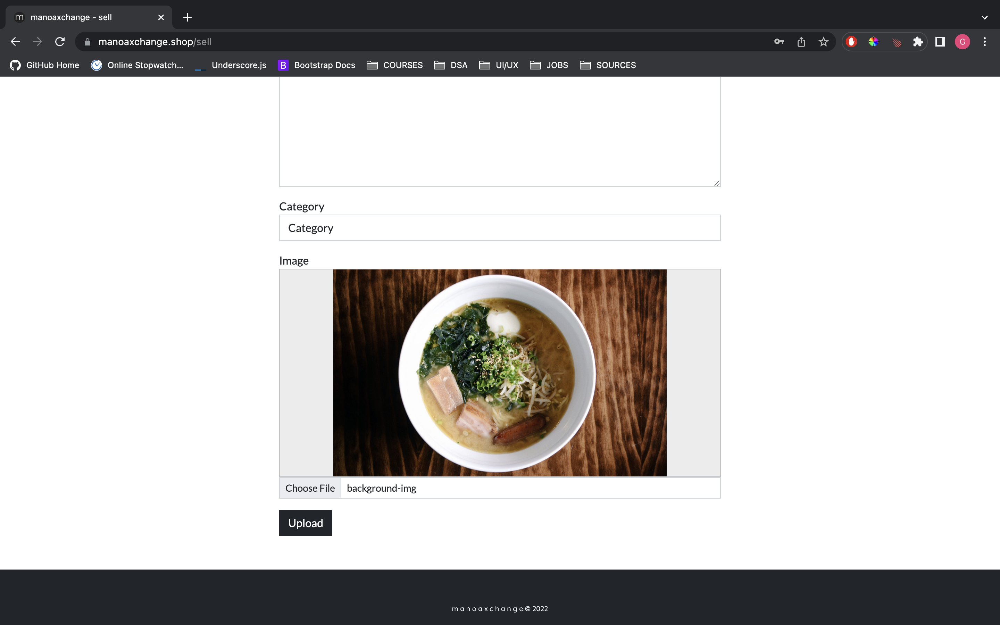
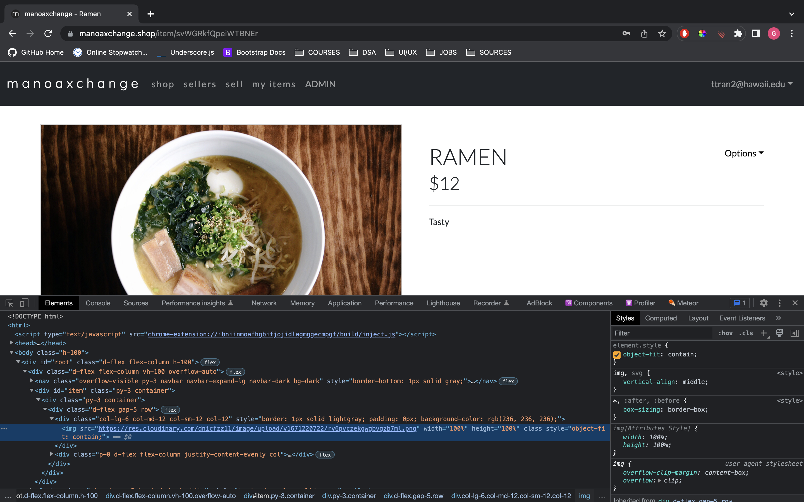

import Container from '../../components/Container.jsx';
import Header from '../../components/Header.jsx';

<Container>
  <Header 
    site="https://manoaxchange.github.io/"
    github="https://github.com/manoaxchange/manoaxchange"
  >
    ManoaXchange
  </Header>

  
   
  

   
  ManoaXchange is a web application prototype designed to help UH Manoa students, faculty, and alumni sell and buy items. This application would help the UH community repurpose and reuse goods. I led this project by designing the architecture of the application, designing the UI/UX, and lastly using the Gmail API and Cloudinary API. I created API endpoints via Express to establish communication between the client and the two APIs. A highlight from this project was the implementation of image uploading. Upon uploading an image, the user is able to see a preview of the image. Once submitted, the image&apos;s data URL is uploaded to Cloudinary by being sent as a parameter through the API endpoint. Then, the response returns Cloudinary&apos;s URL of the image, which is then stored in MongoDB and used as the image source. Overall, this application taught me a lot about working with APIs and creating a mobile responsive user interface.
   
</Container>
