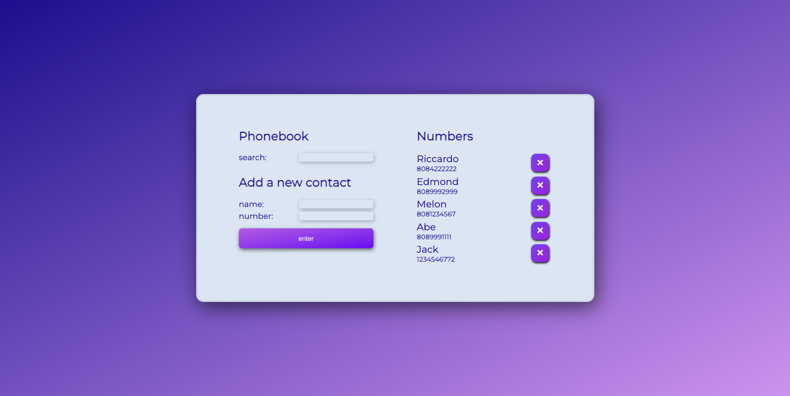

import Container from '../../components/Container.jsx';
import Header from '../../components/Header.jsx';

<Container>
  <Header 
    site="https://phonebook-fso-gt.fly.dev/"
    github="https://github.com/giorgio-tran/fullstackopen/tree/main/part3/phonebook"
  >
    Phonebook
  </Header>

  
  
   
  This is a web application that I created through FullStackOpen. The project helped me learn how to design a CRUD application with the modern MongoDB, Express, React, and NodeJS tech stack (also known as MERN). In Phonebook, the user can search for a contact, add a contact, or remove a contact. If an already existing contact is added, the user will be prompted with an update option.
   
  I gained a lot of experience with developing a full-stack web application through this project. The frontend uses React and CSS, with axios as the HTTP client. The backend uses Express, a Node framework, and MongoDB Atlas for database storage. This experience taught me important concepts, such as Cross-Origin Resource Sharing (CORS), promises, validation, and debugging with both a frontend and a backend. Lastly, the application was originally deployed via Heroku. However, since Heroku will no longer be free in November 2022, I redeployed it to Fly.io.
   
</Container>
