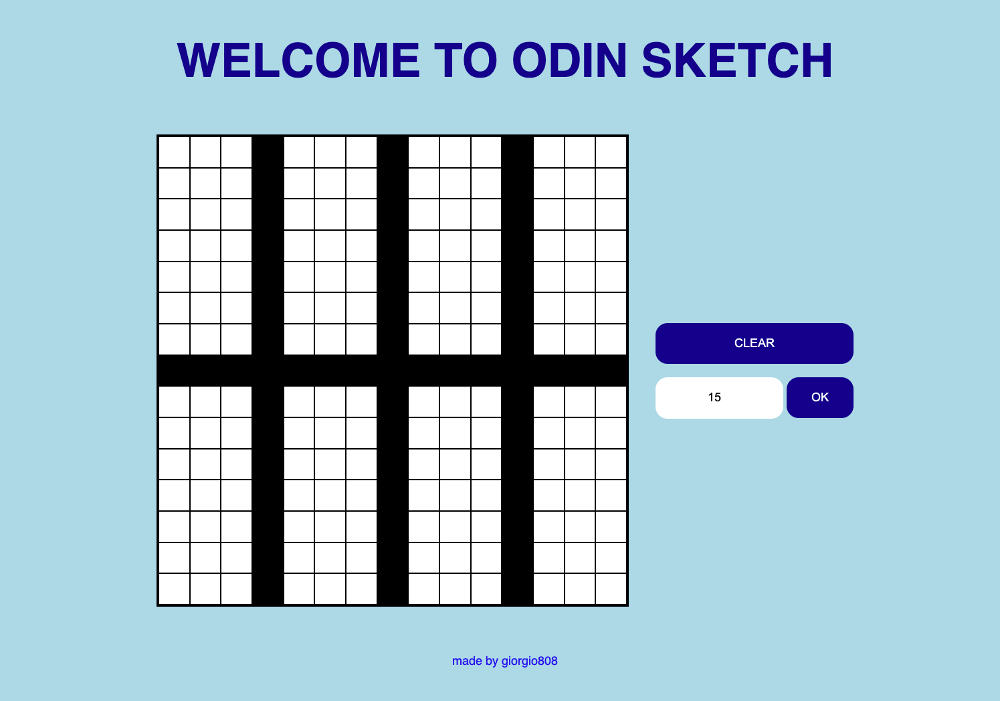

import Container from '../../components/Container.jsx';
import Header from '../../components/Header.jsx';

<Container>
  <Header 
    site="https://giorgio-tran.github.io/odin-sketch/"
    github="https://github.com/giorgio-tran/odin-sketch/"
  >
    Sketch
  </Header>

  

   
  Sketch was one of my first projects when I started learning **HTML, CSS, and JavaScript**. It was an assignment from The Odin Project and it helped me learn how to manipulate the DOM (a way to interact with webpages using code). In Sketch, the user can make drawings by clicking and dragging their mouse. The user may also adjust the number of squares in the grid (up to 100), and reset the grid.
   
</Container>

export const Head = () => <title> Projects - Sketch </title>
